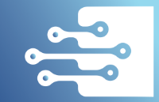

<a name="readme-top"></a>

[![Contributors][contributors-shield]][contributors-url]
[![Forks][forks-shield]][forks-url]
[![Stargazers][stars-shield]][stars-url]
[![Issues][issues-shield]][issues-url]
[![MIT License][license-shield]][license-url]

<br />
<div align="center">
  <a href="https://github.com/statixlabs/kvcopy">
    
  </a>

<h3 align="center">kvcopy</h3>

  <p align="center">
    kvcopy is a command line tool that makes it easier to copy `key=value` data from system to system. You specify the source and the destination and kvcopy will read the `key=value` data from the source and write that data to the destination.
    <br />
    <br />
    <a href="https://github.com/statixlabs/kvcopy/issues">Report Bug</a>
    ·
    <a href="https://github.com/statixlabs/kvcopy/issues">Request Feature</a>
  </p>
</div>

<!-- TABLE OF CONTENTS -->
<details>
  <summary>Table of Contents</summary>
  <ol>
    <li>
      <a href="#about-the-project">About The Project</a>
    </li>
    <li>
      <a href="#getting-started">Getting Started</a>
      <ul>
        <li><a href="#installation">Installation</a></li>
      </ul>
    </li>
    <li><a href="#usage">Usage</a></li>
    <li><a href="#development">Development</a></li>
    <li><a href="#contributing">Contributing</a></li>
    <li><a href="#license">License</a></li>
  </ol>
</details>

<!-- GETTING STARTED -->
## Getting Started

### Installation

### 1. Shell (Mac/Linux)
Install the latest version:
```
curl -fsSL https://github.com/StatixLabs/clifig/raw/main/install.sh | bash
```

<p align="right">(<a href="#readme-top">back to top</a>)</p>


<!-- USAGE EXAMPLES -->
## Usage

Use this space to show useful examples of how a project can be used. Additional screenshots, code examples and demos work well in this space. You may also link to more resources.

```
clifig --input ssm --output env --profile default --region us-east-1 --prefix /test/
```

<p align="right">(<a href="#readme-top">back to top</a>)</p>


## Development

### Testing:

Run Test:
```
go test ./...
```

Setting up ginkgo for a package:
```
ginkgo bootstrap
```

Generate tests:
```
ginkgo generate <name of file>
```

### Build:
using [goreleaser](https://goreleaser.com/) for build.
```
brew install goreleaser/tap/goreleaser
```

<p align="right">(<a href="#readme-top">back to top</a>)</p>


<!-- CONTRIBUTING -->
## Contributing

Contributions are what make the open source community such an amazing place to learn, inspire, and create. Any contributions you make are **greatly appreciated**.

If you have a suggestion that would make this better, please fork the repo and create a pull request. You can also simply open an issue with the tag "enhancement".
Don't forget to give the project a star! Thanks again!

1. Fork the Project
2. Create your Feature Branch (`git checkout -b feature/AmazingFeature`)
3. Commit your Changes (`git commit -m 'Add some AmazingFeature'`)
4. Push to the Branch (`git push origin feature/AmazingFeature`)
5. Open a Pull Request

<p align="right">(<a href="#readme-top">back to top</a>)</p>


<!-- LICENSE -->
## License

Distributed under the MIT License. See `LICENSE.txt` for more information.

<p align="right">(<a href="#readme-top">back to top</a>)</p>


<!-- MARKDOWN LINKS & IMAGES -->
<!-- https://www.markdownguide.org/basic-syntax/#reference-style-links -->
[contributors-shield]: https://img.shields.io/github/contributors/statixlabs/kvcopy.svg?style=for-the-badge
[contributors-url]: https://github.com/statixlabs/kvcopy/graphs/contributors
[forks-shield]: https://img.shields.io/github/forks/statixlabs/kvcopy.svg?style=for-the-badge
[forks-url]: https://github.com/statixlabs/kvcopy/network/members
[stars-shield]: https://img.shields.io/github/stars/statixlabs/kvcopy.svg?style=for-the-badge
[stars-url]: https://github.com/statixlabs/kvcopy/stargazers
[issues-shield]: https://img.shields.io/github/issues/statixlabs/kvcopy.svg?style=for-the-badge
[issues-url]: https://github.com/statixlabs/kvcopy/issues
[license-shield]: https://img.shields.io/github/license/statixlabs/kvcopy.svg?style=for-the-badge
[license-url]: https://github.com/statixlabs/kvcopy/blob/master/LICENSE.txt
